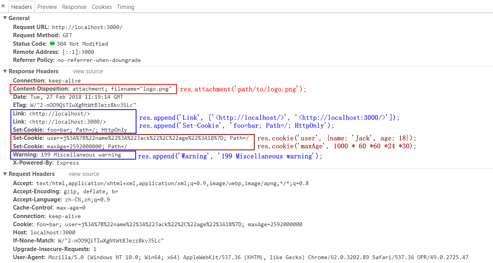

# Response对象
## 3.1 `res.headersSent`
res.headersSent,布尔属性,app是否发送了http headers
```node
app.get('/', function (req, res) {
  console.log(res.headersSent); // false
  res.send('OK');
  console.log(res.headersSent); // true
})
```
## 3.2 `res.append(filed,[value])`

<br/>
+ res.append(),添加响应头信息
+ 使用`res.append()`之后调用`res.set()`将会重置先前设置的头信息
```node
res.append('Link', ['<http://localhost/>', '<http://localhost:3000/>']);
res.append('Set-Cookie', 'foo=bar; Path=/; HttpOnly');
res.append('Warning', '199 Miscellaneous warning');
```
## 3.3 `res.attachment([filename])`
+ 设置HTTP响应`Content-Disposition`字段`attachment`
+ 如果参数为空,那么设置`Content-Disposition:attachment`
+ 如果参数有值,那么将基于`res.type()`扩展名设置`Content-Type`的值,并且设置`Content-Disposition`的值为参数值
```node
res.attachment();
// Content-Disposition: attachment

res.attachment('path/to/logo.png');
// Content-Disposition: attachment; filename="logo.png"
// Content-Type: image/png
```
## 3.4 `res.cookie(name, value, [options])`
+ 设置cookie的name和value,value值可以是string或object,options是一个对象
+ domain,string,cookie的域名,默认为该app的域名
+ expires,date,过期时间
+ httpOnly,boolean,cookie的标志位,只能允许http web server
+ maxAge,string,用于设置过期时间相对于当前时间 (以毫秒为单位) 的选项.
+ path,string,cookie的路径,默认为`/`
+ secure,boolean,标记只用于 HTTPS 的 cookie.
+ signed,boolean,指示是否应对 cookie 进行签名.(有问题,需要cookie-parser)
> 所有的 res cookie () 都是用所提供的选项设置 HTTP 设置 cookie 头.任何未指定的选项都默认为 RFC 6265 中所述的值.
> 使用 cookie-parser 中间件时, 此方法还支持签名的 cookie.只需将签名的选项设置为 true.然后, res cookie () 将使用传递给 cookieParser (秘密) 的秘密来签署该值.

## 3.5 `res.clearCookie(name, [options])`
+ 通过name清除cookie

## 3.6 `res.download(path, [filename], [callback(err){...}])`
+ 下载文件
```node
router.get('/', function (req, res, next) {
    res.download('static/download/file.pdf', 'file.pdf', function(err){
        if(err){
            res.send(err);
        }
    })
})
```

## 3.7 `res.end([data], [encoding])`
+ 结束响应进程,不需要返回任何数据,如果需要返回数据,可以使用`res.send()`或者`res.json()`

## 3.8 `res.get(field)`
+ 通过字段返回HTTP请求头信息,大小写敏感
```node
res.get('Content-Type');
// => "image/png"
```

## 3.9 `res.json([body])`
+ 发送一个JSON响应,方法类似于带有一个对象参数或数组参数的`res.send()`
+ 参数也可以为`null`或者`undefined`
```node
res.json(null)
res.json({ user: 'tobi' })
res.status(500).json({ error: 'message' })
```
## 3.10 `res.links(links)`
+ 填充响应的链接HTTP标题头字段
```node
res.links({
    next: 'http://localhost:3333/users?page=2',
    next: 'http://localhost:3333/users?page=5'
})
```
## 3.11 `res.redirect([status], path)`
+ 重定向,如果不指定status状态,默认状态码status code为302 Found
+ 如果要跳转到外部的链接,需要加上`http://`
+ 返回上一步的页面`res.redirect('back');`
+ 返回上一级的页面,如果现在是在`http://example.com/admin/post/new`页面,想要跳转到上一级页面`http//example.com/admin/post`,使用`res.redirect('..');`
```node
res.redirect('/users');
res.redirect(301, 'http://localhost:3333/login')
```

## 3.12 `res.render(view, [locals], [callback(err,html){...}])`
+ 渲染页面

## 3.13 `res.send([body])`
+ 发送HTTP响应
+ 参数可以是String,Buffer,Array
```node
res.send(new Buffer('whoop'));
res.send({ some: 'json' });
res.send('<p>some html</p>');
res.status(404).send('Sorry, we cannot find that!');
res.status(500).send({ error: 'something blew up' });
```

## 3.14 `res.sendFile(path, [options], [callback(err){...}])`
+ 在给定路径上传输文件.根据文件名的扩展名设置内容类型响应 HTTP 标头字段.除非在选项对象中设置了根选项, 否则路径必须是文件的绝对路径.
+ options是一个对象选项
+ maxAge,以毫秒为单位设置`Cache-Control`标题头的最大属性或 ms格式的字符串,默认为0
+ root,相对文件名的根目录
+ lastModified,将`Last-Modified`的标题头设置为操作系统上文件的最后修改日期.设置为`false`以禁用它.
+ headers,包含要与文件一起服务的 HTTP 标头的对象.
+ dotfiles,服务`dotfiles`的选项.可能的值是`allow`,`deny`,`ignore`,默认值为`ignore`
```node
router.get('/file/:name', function (req, res, next) {
    let options ={
        root: './public/static/download/',
        dotfiles: 'deny',
        headers:{
            'x-timestamp': Date.now(),
            'x-sent': true
        }
    };
    
    let fileName = req.params.name;
    res.sendFile(fileName, options, function(err){
        if(err){
            console.log(err);
            res.status(err.status).end();
        }else{
            console.log('Sent: ',fileName)
        }
    })
});
```

## 3.15 `res.sendStatus(statusCode)`
+ 将响应 HTTP 状态代码设置为statusCode, 并将其字符串表示形式作为响应正文发送.
```node
res.sendStatus(200); // equivalent to res.status(200).send('OK')
res.sendStatus(403); // equivalent to res.status(403).send('Forbidden')
res.sendStatus(404); // equivalent to res.status(404).send('Not Found')
res.sendStatus(500); // equivalent to res.status(500).send('Internal Server Error')
```

## 3.16 `res.set(field, [value])`
+ 设置响应头,可以单个设置,也可以用一个对象设置
```node
res.set('Content-Type', 'text/plain');

res.set({
  'Content-Type': 'text/plain',
  'Content-Length': '123',
  'ETag': '12345'
})
```

## 3.17 `res.status(code)`
+ 使用此方法可设置响应的HTTP状态.它是节点响应的式别名statusCode
```node
res.status(403).end();
res.status(400).send('Bad Request');
res.status(404).sendFile('/absolute/path/to/404.png');
```

## 3.18 `res.type(type)`
+ 将内容类型 HTTP 标头设置为指定类型的`mime. lookup ()`所确定的 mime 类型。如果 type 包含 "/" 字符, 则将`Content-Type`设置为`type`。
```node
res.type('.html');              // => 'text/html'
res.type('html');               // => 'text/html'
res.type('json');               // => 'application/json'
res.type('application/json');   // => 'application/json'
res.type('png');                // => image/png:
```

## 3.19 `res.vary(filed)`
+ 将该字段添加到不同的响应标头 (如果它尚未存在)。

```node
res.vary('User-Agent').render('docs');
```