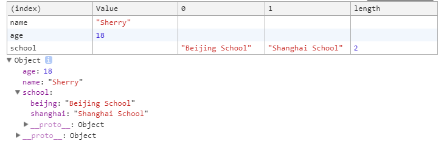
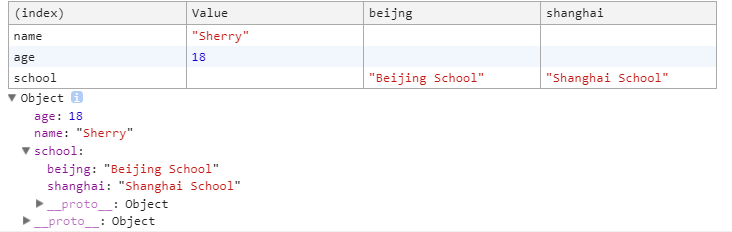
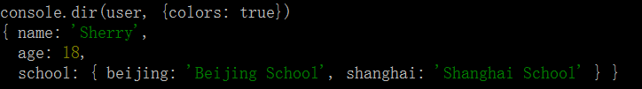

# 常用的Console对象的属性
### 1. `console.log()`和`console.info()`
+ 浏览器环境和Node环境下都可以正常输出，功能类似

### 2. `console.warn()`和`console.error()`
+ 普通的分类输出，如果参数不为错误
+ 那么浏览器端发出警告信息和错误内容
+ 那么Node环境下输出的是普通正常内容

### 3. `console.debug()`
+ Node环境下`console.debug()`报错
+ 前端`debug`，可以使用`chrome`的插件`Alt Devtools`，在需要`debug`的地方，直接输入`debugger`就可以停在这里
+ 后端`debug`，直接使用`npm`下载`node-inspector`，使用时，直接在命令行输入`node-inspector`，打开浏览器，在需要`debug`的地方打断点

### 4. `console.table()`
+ 表格形式输出内容
+ 浏览器端以表格形式显示数据，并且显示数据及其原型
**数据格式01**
```javascript
const user = {
    name: 'Sherry',
    age: 18,
    school: ['Beijing School', 'Shanghai School'],
}
console.table(user);
```



**数据格式02**
```javascript
const user = {
    name: 'Sherry',
    age: 18,
    school: {
        beijing: 'Beijing School',
        shanghai: 'Shanghai School'
    }
}
console.table(user)
```



+ Node环境下`console.table()`报错

### 5. `console.count()`
+ 浏览器端，输出这个方法被调用了多少次
    * `for`循环里计数
    * 某一个`function`调用了多少次
    * 在全局调用将一直输出`1`
+ Node环境下`console.count()`报错

### 6. `console.dir()`
+ 对象形式输出内容
+ 浏览器端
    * 输入普通参数，结果就是输出参数的值，就是`console.table()`输出的去掉表格的部分
    * 以目录树的形式，显示 DOM 节点。参数可以为`document`或者`document.body`等DOM节点，输出DOM节点的属性
+ Node环境下输出普通的文本内容， 但是可以显示不同颜色
```javascript
console.log('console.dir(user, {colors: true})');
const user = {
    name: 'Sherry',
    age: 18,
    school: {
        beijing: 'Beijing School',
        shanghai: 'Shanghai School'
    }
}
console.dir(user, {colors: true})
```



### 7. `console.dirxml()`
+ 浏览器DOM节点形式输出
+ 浏览器端
    * 输入普通参数，结果就是输出参数的值，就是`console.table()`输出的去掉表格的部分
    * 参数可以为`document`或者`document.body`等DOM节点，输出DOM节点的`HTML`的内容
+ Node环境下`console.dirxml()`报错

### 8. `console.time()`和`console.timeEnd()`
+ 计算某个操作耗费的时间
+ 操作所花费的时间，浏览器端和Node环境下都可以使用，功能相同
```javascript
console.time('for 1000000 times');
for(let i = 0; i < 1000000; i++){

}
console.timeEnd('for 1000000 times');
```

输出结果:`for 1000000 times: 3.094ms`

### 9. `console.assert()`
+ 条件判断形式输出内容
+ `console.assert(<判断条件>, <条件为false时的输出>)`作用就是进行条件判断，第一个参数为`true`或`false`的判断条件，第二个参数是如果第一个参数为`false`时的输出，如果第一个参数为`true`，那么第二个参数不输出
+ 浏览器端和Node环境下都可以使用