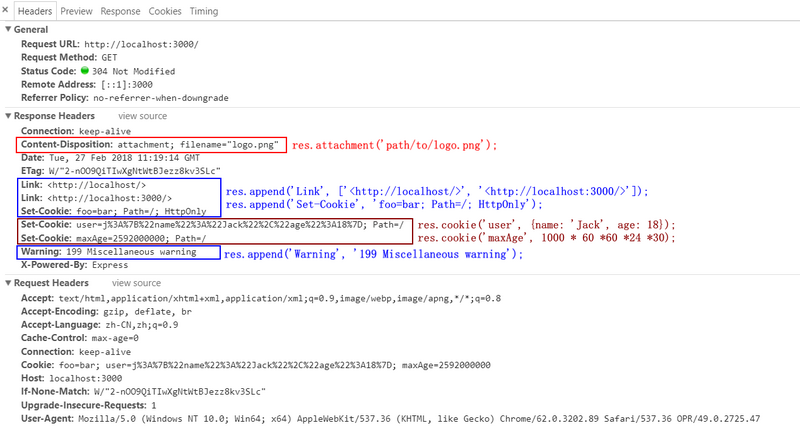

## 3. response对象
## 3.1 是否发送了响应头
+ `res.headersSent`布尔属性,`app`是否发送了http`headers`
```javascript
const express = require('express');
const bodyParser = require('body-parser');
const cookieParser = require('cookie-parser')
const app = express();

app.use(bodyParser.json());// parsing application/json
app.use(bodyParser.urlencoded({ extended: true }));// parsing application/x-www-form-urlencoded
app.use(cookieParser())

app.get('/', (req, res) => {
    console.log(res.headersSent); // false
    res.send('OK');
    console.log(res.headersSent); // true
})
app.listen(3000);
```

## 3.2 添加响应头信息
+ `res.append(filed,[value])`添加响应头信息
+ 使用`res.append()`之后调用`res.set()`将会重置先前设置的头信息
```javascript
const express = require('express');
const app = express();
app.get('/', (req, res) => {
    console.log(res.headersSent); // false
    res.append('Link', ['<http://localhost/>', '<http://localhost:3000/>']);
    res.append('Set-Cookie', 'foo=bar; Path=/; HttpOnly');
    res.append('Warning', '199 Miscellaneous warning');
    res.attachment('path/to/logo.png');
    res.cookie('user', { name: 'Jack', age: 18 });
    res.cookie('maxAge', 1000 * 60 * 60 * 24 * 30);
    res.send('OK');
    console.log(res.headersSent); // true
})
app.listen(3000);
```

## 3.3 设置HTTP响应`Content-Disposition`字段`attachment`
+ `res.attachment([filename])`
+ 设置HTTP响应`Content-Disposition`字段`attachment`
+ 如果参数为空,那么设置`Content-Disposition:attachment`
+ 如果参数有值,那么将基于`res.type()`扩展名设置`Content-Type`的值,并且设置`Content-Disposition`的值为参数值
```javascript
res.attachment();
// Content-Disposition: attachment

res.attachment('path/to/logo.png');
// Content-Disposition: attachment; filename="logo.png"
// Content-Type: image/png
```

## 3.4 设置`cookie`信息
+ `res.cookie(name, value, [options])`
+ 清除`cookie`信息`res.clearCookie(name, [options])`
+ 设置`cookie`的`name`和`value`,`value`值可以是`string`或`object`,`options`是一个对象
+ `domain`,`string`,`cookie`的域名,默认为该`app`的域名
+ `expires`,`date`,过期时间
+ `httpOnly`,`boolean`,`cookie`的标志位,只能允许`http web server`
+ `maxAge`,`string`,用于设置过期时间相对于当前时间 (以毫秒为单位) 的选项.
+ `path`,`string`,`cookie`的路径,默认为`/`
+ `secure`,`boolean`,标记只用于`HTTPS`的`cookie`.
+ `signed`,`boolean`,指示是否应对`cookie`进行签名.(有问题,需要`cookie-parser`)
> 所有的`res.cookie ()`都是用所提供的选项设置`HTTP`设置`cookie`头.任何未指定的选项都默认为`RFC 6265`中所述的值.
> 使用`cookie-parser`中间件时, 此方法还支持签名的`cookie`.只需将签名的选项设置为 true.然后,`res cookie ()`将使用传递给`cookieParser`(秘密) 的秘密来签署该值.

## 3.5 响应下载信息
+ `res.download(path, [filename], [callback(err){...}])`
```javascript
const express = require('express');
const app = express();
app.get('/', (req, res) => {
    res.download('static/download/file.pdf', 'file.pdf', (err) => {
        if (err) {
            res.send(err);
        }
    });
})
app.listen(3000);
```

## 3.6 结束响应进程
+ `res.end([data], [encoding])`
+ 不需要返回任何数据,如果需要返回数据,可以使用`res.send()`或者`res.json()`

## 3.7 获取请求头信息
+ `res.get(field)`
+ 通过字段返回`HTTP`请求头信息,大小写敏感
```javascript
res.get('Content-Type');
// => "image/png"
```

## 3.8 发送一个`JSON`响应
+ `res.json([body])`
+ 方法类似于带有一个对象参数或数组参数的`res.send()`
+ 参数也可以为`null`或者`undefined`
```javascript
res.json(null)
res.json({ user: 'tobi' })
res.status(500).json({ error: 'message' })
```
## 3.9 填充响应的链接HTTP标题头字段
+ `res.links(links)`
```javascript
res.links({
    next: 'http://localhost:3000/users?page=2',
    next: 'http://localhost: /users?page=5'
})
```

## 3.10 响应重定向
+ `res.redirect([status], path)`
+ 如果不指定`status`状态,默认状态码`status code`为`302 Found`
+ 如果要跳转到外部的链接,需要加上`http://`
+ 返回上一步的页面`res.redirect('back');`
+ 返回上一级的页面,如果现在是在`http://example.com/admin/post/new`页面,想要跳转到上一级页面`http//example.com/admin/post`,使用`res.redirect('..');`
```javascript
res.redirect('/users');
res.redirect(301, 'http://localhost:3000/login')
```

## 3.11 渲染模板引擎
+ `res.render(view, [locals], [callback(err,html){...}])`
+ 模板引擎一般有`ejs`,`jade`,`html`

## 3.12 发送HTTP响应信息
+ `res.send([body])`
+ 参数可以是`String`,`Buffer`,`Array`
```javascript
res.send(new Buffer('whoop'));
res.send({ some: 'json' });
res.send('<p>some html</p>');
res.status(404).send('Sorry, we cannot find that!');
res.status(500).send({ error: 'something blew up' });
```

## 3.13 给定路径上传输文件
+ `res.sendFile(path, [options], [callback(err){...}])`
+ 根据文件名的扩展名设置内容类型响应`HTTP`标头字段.除非在选项对象中设置了根选项, 否则路径必须是文件的绝对路径.
+ `options`是一个对象选项
+ `maxAge`,以毫秒为单位设置`Cache-Control`标题头的最大属性或`ms`格式的字符串,默认为`0`
+ `root`,相对文件名的根目录
+ `lastModified`,将`Last-Modified`的标题头设置为操作系统上文件的最后修改日期.设置为`false`以禁用它.
+ `headers`,包含要与文件一起服务的`HTTP`标头的对象.
+ `dotfiles`,服务`dotfiles`的选项.可能的值是`allow`,`deny`,`ignore`,默认值为`ignore`
```javascript
router.get('/file/:name', (req, res, next) => {
    let options ={
        root: './public/static/download/',
        dotfiles: 'deny',
        headers: {
            'x-timestamp': Date.now(),
            'x-sent': true
        }
    };
    
    let fileName = req.params.name;
    res.sendFile(fileName, options, (err) => {
        if(err){
            console.log(err);
            res.status(err.status).end();
        }else{
            console.log('Sent: ',fileName)
        }
    })
});
```

## 3.14 设置状态代码
+ `res.sendStatus(statusCode)`
+ 将响应`HTTP`状态代码设置为`statusCode`, 并将其字符串表示形式作为响应正文发送.
```javascript
res.sendStatus(200); // equivalent to res.status(200).send('OK')
res.sendStatus(403); // equivalent to res.status(403).send('Forbidden')
res.sendStatus(404); // equivalent to res.status(404).send('Not Found')
res.sendStatus(500); // equivalent to res.status(500).send('Internal Server Error')
```

## 3.15 设置响应头信息
+ `res.set(field, [value])`
+ 可以单个设置,也可以用一个对象设置
```javascript
res.set('Content-Type', 'text/plain');

res.set({
  'Content-Type': 'text/plain',
  'Content-Length': '123',
  'ETag': '12345'
})
```

## 3.16 设置响应状态
+ `res.status(code)`
+ 使用此方法可设置响应的`HTTP`状态.它是节点响应的式别名`statusCode`
```javascript
res.status(403).end();
res.status(400).send('Bad Request');
res.status(404).sendFile('/absolute/path/to/404.png');
```

## 3.17 设置响应类型
+ `res.type(type)`
+ 将内容类型`HTTP`标头设置为指定类型的`mime.lookup()`所确定的`mime`类型。如果`type`包含`/`字符, 则将`Content-Type`设置为`type`。
```javascript
res.type('.html');              // => 'text/html'
res.type('html');               // => 'text/html'
res.type('json');               // => 'application/json'
res.type('application/json');   // => 'application/json'
res.type('png');                // => 'image/png:'
```

## 3.18 添加字段到不同的响应头
+ `res.vary(filed)`
+ 将该字段添加到不同的响应标头 (如果它尚未存在)。
```javascript
res.vary('User-Agent').render('docs');
```